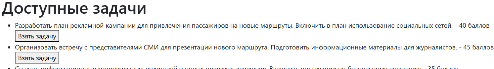

### При возникновении ошибок при запуске, связанных с заполнением данных выполнить команду очисте данных в БД
```dtd
TRUNCATE TABLE document_file , equipment , task, task_history, transport, user_bonuses, users RESTART IDENTITY CASCADE;
```
1. Авторизация в приложении (Spring Security)
   Авторизация как **пользователь**:
   
   Авторизация как **администратор**:
   
---
2. На главной странице есть возможность добавить новый борт:
   
---
3.  Переход на форму с оборудованием конкретного борта (К тому же, возможность изменения статуса оборудования кликом по его статусу):


---
4. Добавление оборудования на форме с оборудованием:
   
---
5. В профиле пользователя можно получить ежедневный бонус, за посещение приложения (При условии, если сегодня бону был взят - появится уведомление):
   
---
6. Добавление отчетов (в профиле, через отдельную форму):
   
---
7. В отдельной форме, есть возможность взять дополнительную задачу, чтобы получить дополнительные бонусные баллы (после выполнения - подтверждение в профиле):
   
---
8. После авторизации как администратор (localhost:8080/login). Можно получить доступ к задачам на проверку и утверждение получения бонусов пользователю или отклонение:
   !
